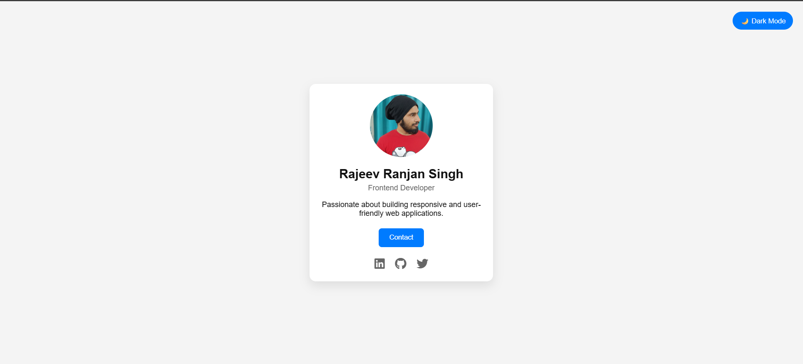
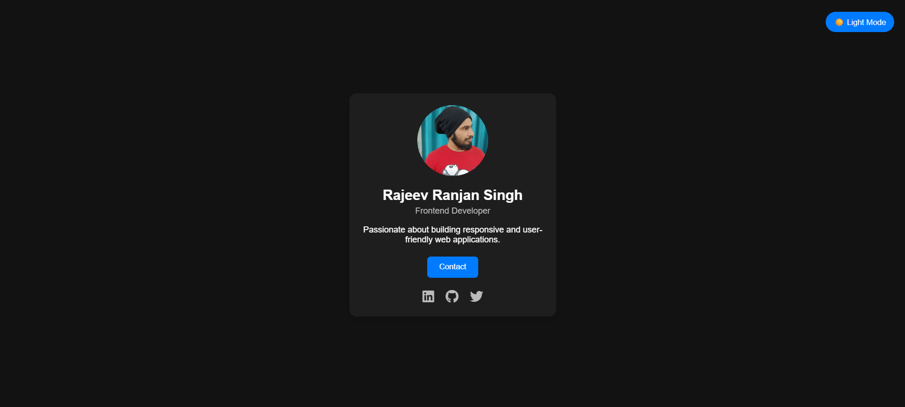
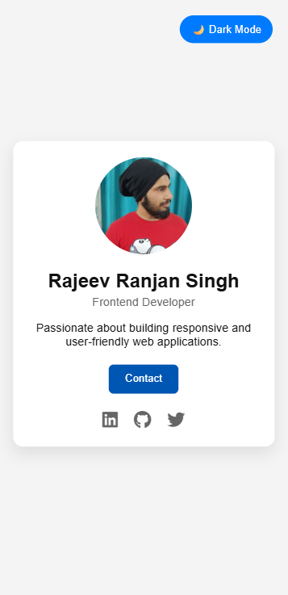
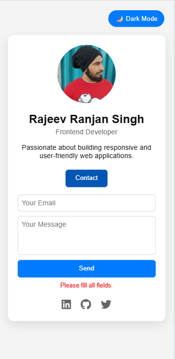

# 🌟 Responsive Profile Card

A modern, responsive, and interactive profile card built using HTML, CSS, and JavaScript.

This project demonstrates clean UI design, dark mode implementation, DOM manipulation, form validation, and micro-interactions.

---

## 📸 Project Preview

### 💻 Desktop Light Mode

### 🌙 Desktop Dark Mode

### 📱 Mobile View

### 📝 Contact Form Expanded

---

## ✨ Features

- ✅ Fully Responsive Design
- 🌙 Dark Mode with Persistent Theme (localStorage)
- 🎨 Glassmorphism Card Design
- 🔗 Dynamic Social Media Links
- 📩 Expandable Contact Form
- ✔ Form Validation with Regex
- 💫 Micro-Interactions (Hover, Ripple, Animations)
- 🧠 Data-Driven Rendering using JavaScript

---

## 🛠 Technologies Used

- HTML5
- CSS3 (Flexbox, CSS Variables, Animations)
- JavaScript (DOM Manipulation, Events, LocalStorage)
- Git & GitHub
- GitHub Pages (Deployment)

---

## 📂 Project Structure

responsive-profile-card/
│
├── index.html
├── style.css
├── script.js
└── assets/
└── profile.jpg

---

## 🎯 Key Learning Highlights

### 1️⃣ Responsive Layout
Used flexible width with `max-width` and Flexbox centering to ensure mobile-first responsiveness.

### 2️⃣ Dark Mode Implementation
Implemented using CSS variables and `localStorage` for theme persistence across sessions.

### 3️⃣ Data-Driven UI
Profile information and social links are dynamically injected from a JavaScript object instead of hardcoded HTML.

### 4️⃣ Form Validation
Implemented client-side validation using regular expressions to ensure proper email format.

### 5️⃣ UI/UX Enhancements
Added hover animations, ripple effect, image zoom, and fade-in transitions for better user experience.

---

## 📬 Contact

If you’d like to connect:

- GitHub: https://github.com/itisrajeevsingh
- LinkedIn: https://www.linkedin.com/in/itisrajeevsingh
- Twitter: https://twitter.com/itisrajeevsingh

---

## 📌 Author

**Rajeev Ranjan Singh**  
Frontend Developer

---

⭐ If you found this project useful, feel free to star the repository!
